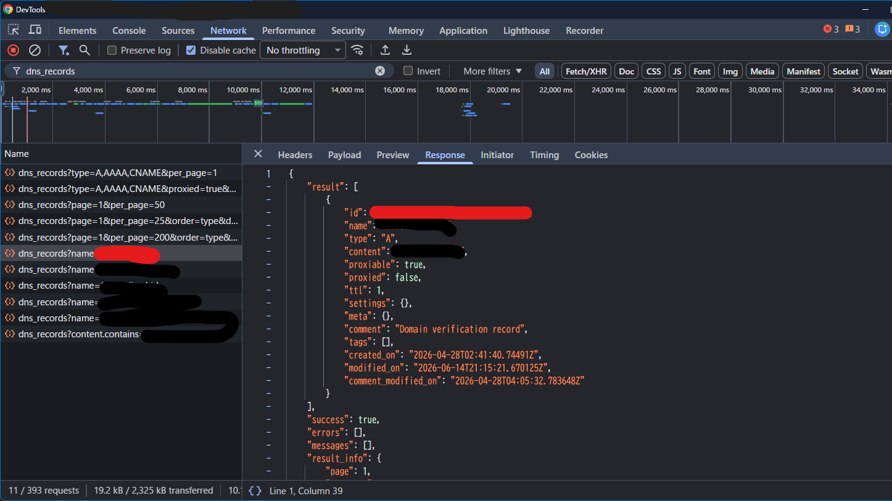

## cloudflare ddns
cloudflare に適用したDDNS


## setup
### env
`.env.example`を`.env`としてコピー

| key      | value                                                | 
| -------- | ---------------------------------------------------- | 
| DOMAIN   | DDNSを適用したいドメイン                             | 
| EMAIL    | cloudflareアカウントのメアド                         | 
| ZONEID   | cloudflareドメイントップページの下部、右側にあるやつ | 
| RECORDID | 後述                                                 | 
| TOKEN    | レコード更新に必要な権限があるトークン               | 
| KEY      | TOKEN使用のためのアカウントキー                      | 


ZONEIDは割と調べたらすぐ見つかると思います。分からなかったら調べてください

### RECORDID
RECORDIDは一般的にAPIを叩くらしいですが、より簡単な方法が見つかりました。

1. cloudflareのコンソールを開く
2. f12て押して検証ツール->ネットワークタブを開く
3. 対称のドメインのDNS設定を開く
4. filterにdns_recordsを適用
5. `dns_records?name={your_domain}の通信があるので中身を確認
6. ["result"][0]["id"]を確認

これがRECORDIDになります。

詳しくは写真を参考にしてみてください。赤い線のところを注目して確認してみてください。




### TOKENとKEY

https://dash.cloudflare.com/profile/api-tokens

↑にアクセスし適切なトークンを生成

ゾーンDNSを編集するというテンプレートがあるのでそれをそのまま使います。

またKEYはその下にあります

### さいごに
```bash
$ sudo ./install.sh
```

を実行！

serviceとして動きます、あとtimerも登録されるので定期的に実行されます。
